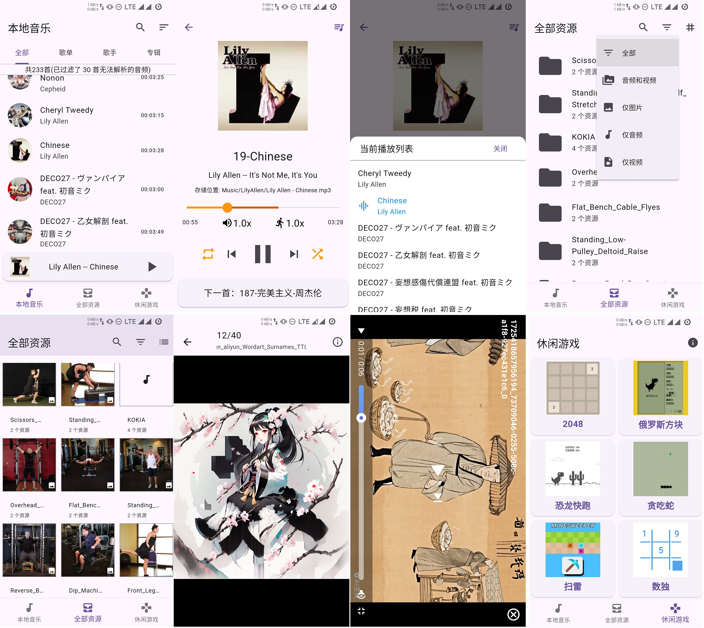

# Freader Media Player

freader-media-player(FMP Player)，一个使用 flutter 开发的简单的本地媒体资源播放器：

- 可用于播放本地音频、浏览本地图片、观看本地视频。
- 添加了“2048”、“俄罗斯方块”、“恐龙快跑”、“贪吃蛇”、“扫雷”、“数独”等小游戏。
  - 尝试做到“视听娱乐”不耽误。

## 更新说明

[CHANGELOG](CHANGELOG.md)

## 主要功能

- **本地音乐**
  - 提供`全部`、`歌单`、`歌手`、`专辑`分类，支持关键字查询和排序调整。
  - 支持后台播放，状态栏显示歌曲名称。
- **全部资源**
  - 自动扫描设备中的音频、视频、图片等媒体文件，支持分类筛选和模糊查询。
  - 文件夹可切换网格或列表显示，点击文件夹后显示对应媒体资源列表，支持预览或播放。
    - 图片支持左右滑动和双指缩放；
    - 点击音频文件夹任意音频，会加入到当前播放列表，与“本地音乐”模块共用播放器；
      - 退出 app 后不保留该文件夹播放列表；
    - 视频文件加入播放列表并自动连播，播放器支持多种控制功能。
- **休闲游戏**
  - 添加了“2048”、“俄罗斯方块”、“恐龙快跑”、“贪吃蛇”、“扫雷”、“数独”等小游戏。

**由于权限管控越发严格，本地资源均不再提供任何异动(例如重命名、复制、删除等)功能。**

粗略截图如下：

## 开发环境

- 在 Windows 7 主机下使用 VirtualBox7.0 安装的 Ubuntu22.04 虚拟机，配合 VS Code1.94.2 进行开发；
- flutter 版本为 3.24.4，java 版本为 temurin-17.0.6。

**仅 Android 平台**，且仅在下面设备进行过实机测试，**其他平台完全没处理**：

- Nubia Z60 Ultra (Android 14，分辨率 `2480 * 1116`)
- Nubia Z50 Ultra (Android 13，分辨率 `2480 * 1116`)
- xiaomi 6 (Android 13，分辨率 `1920 * 1080` )

## 遗留问题

暂未处理的问题

### **2024-02-19**

- 使用的组件相关
  1. on_audio_query: ^2.9.0
     - 从 2.7.0 版本开始使用，插件的修改歌单名称 `renamePlaylist()` 方法报错，堆栈溢出，暂时无解
     - `queryPlaylists()` 中的音频 id 与原始音频 id 不一致，无法直接获取原始音频的图片等信息
       - 目前是通过音频名称查询得到该音频原始信息，再使用其图片。
     - `queryWithFilters()` 接口 查询 playlist 的时候有 bug，没有 `numOfSongs` 属性。所以转为 PlaylistModel 会报错。
       - 目前是转为 map，取得`_id`属性，再使用 queryAudiosFrom 从 playlist 中查询拥有的音频数量，再手动构建`num_of_songs`属性，然后再转为 PlaylistModel 类型。
  2. photo_manager: ^3.0.0-dev.5
     - 在配合[photo_view](https://pub.dev/packages/photo_view)使用时，`PhotoViewGallery.builder()`的`PhotoViewGalleryPageOptions()`的 `imageProvider`属性需要是`ImageProvider`类型，但 photo_manager 取得的文件资源 AssetEntity 的 file 属性是一个 `Future<File?>`。
     - 在使用`PhotoManager.getAssetPathList()`条件查询时，如果`filterOption`参数直接使用它的高级查询 AdvancedCustomFilter/CustomFilter ，那么同时设定`type`参数不会生效。
  3. photo_manager 和 flick_video_player/video_player
     - 如果视频是 Windows7 系统自动的那个范例视频`野生生物.wmv`(Wildlife.wmv)，不仅无法生成缩略图，也无法播放。
       - photo_manager 能识别出来是个视频，但是无法解析任何相关信息
       - video_player 无法识别，所以不能播放。
       - 但是，这两个插件会报一大堆错误，然后你无法处理
  4. 我是最近才知道 flutter_riverpod，所以和 provider 同时存在了两个状态管理组件，推荐统一为前者，但先就这样。
- 能力水平相关：
  1. 本地音乐中`音频列表`长按后显示`加入歌单`、`查看信息`等按钮，但其实长按后每次点击都重新渲染了列表组件。
  2. 理论上“本地音乐”在每一首歌播放前都会记录当前的歌单和音乐，但是首次或者前几次使用此 app 时，无法正确记录该值。多几次就正常了。
     - 因为不是很影响使用，虽然不明白为什么，也没有去处理。
  3. 在手机升级到 Android14 后，`flutter run -v`启动卡在 Waiting for VM Service port to be available...，就无法热加载或其他操作，原因不明。
- 以及其他使用 flutter 经验不足或能力不足的各种问题。

